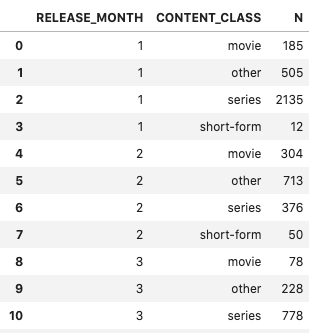
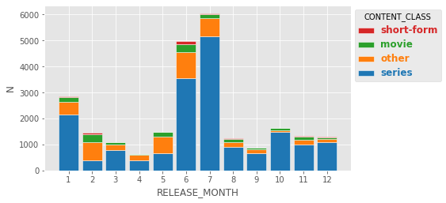
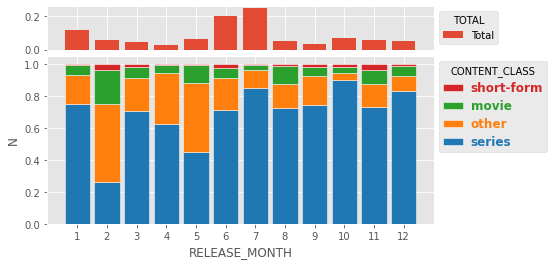
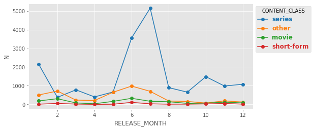
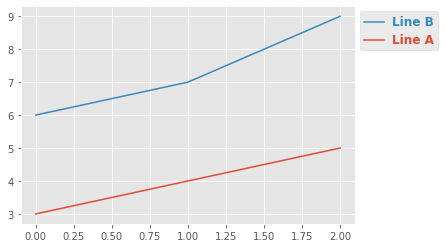
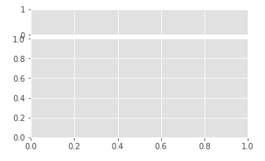
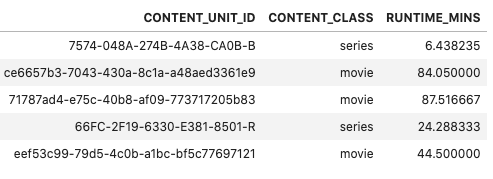
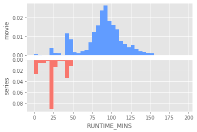
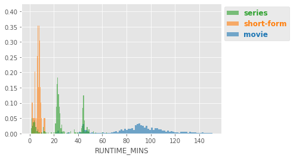
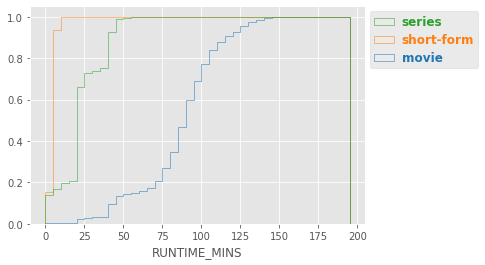

# Enhanced Visualizations
Useful functions for creating visualizations

## Installation
```
!pip3 install git+https://github.com/eddykimdata/eviz
```

## Setup
```
from eviz.eviz import eviz as eviz
```

## Plotting fractional shares (stacked bar or line plots)
This function is used for calculating, for each x-axis value, the fraction contributed by each hue group.  This is typically displayed as a stacked bar chart (for categorical x-values) or a line plot (for numeric or date x-values).  See sections below.  

The data should be a pandas dataframe, and must be in an unpivoted format.  Example data: 


Note that the "kind" parameter must be 'bar' or 'line', with default being 'line'.

```
eviz.shares_plot(
    data,
    x,
    y,
    hue,
    kind='line',
    cmap='Accent',
    normalize=True,
    group_colors=None,
    barWidth=0.85,
    xtick_rotation=0,
    x_order=None,
    hue_order=None,
    marker=None,
    markersize=6,
    grid_height=100,
    margin_plot_height=20,
    margin_plot_spacer=3,
    plot_totals=None,
    totals_label='Total',
    normalize_totals=True,
    totals_marker=None,
    totals_markersize=6,
    height=6,
    width=None,
    reverse_legend_order=True)
```
Description of parameters:
```
    Creates a plot (either stacked bar or line plot) describing shares of a dimension
    for each given x bucket.  Example: x-dimension is DS, and we want to know for
    each DS, the number (or portion) of watches are from each of the 3 devices 
    types 'mobile', 'ctv', and 'desktop'.  The input dataframe should not be
    pivoted, and should be in the form:

    |        DS       | CONTENT_CLASS   |    N |
    |----------------:|:----------------|-----:|
    |      2020-09-01 | other           |  505 |
    |      2020-09-01 | movie           |  185 |
    |      2020-09-01 | short-form      |   12 |
    |      2020-09-01 | series          | 2135 |
    |      2020-09-02 | short-form      |   50 |
    |      2020-09-02 | other           |  713 |

    
    Parameters
    ----------
    data : pandas.DataFrame
        Dataframe should not be pivoted.

    x : str
        Column name that will serve as the x ticks for the stacked bar chart

    y : str
        Column name that contains the values to be plotted on the y axis

    hue : str
        Column name that contains the groups that will be stacked

    cmap : str
        Name of the seaborn color map for choosing colors.  Default is "Accent",
        other popular cmaps include the seaborn default 'tab10', and 'Set2'.

    normalize : boolean
        If true, then the each stacked bar will sum to 1.

    group_colors : dictionary
        Dictionary map of each hue group to its color

    barWidth : float   
        Width of each bar

    xtick_rotation : float
        Degrees of rotation fot he xtick labels

    x_order : list
        Order for the x-axis 

    hue_order : list
        Stacking order (bottom to top) of hue groups for each bar  
    
    marker : str
        Only valid for line plot, add a marker shape

    markersize : int
        Only valid for line plot, changes size of marker

    grid_height : int
        Only valid if plot_totals is not None, this number will determine the 
        relative height of the two subplots (main plot height + totals plot height)

    margin_plot_height : int
        Only valid if plot_totals is not None, this number will determine the size 
        of the margin plot, with the remainder of the grid_height being 
        allocated to the main plot's height and margin_plot_spacer.  

    margin_plot_spacer : int
        Only valid if plot_totals is not None, this number will create additional 
        space between the two subplots, allocated from the total grid_height
        (the main plot's height will be grid_height - margin_plot_height - 
        margin_plot_spacer). 

    plot_totals : str
        Default value: None.  Parameter value can be [None, 'bar', 'line'].  
        If not None, then a subplot will plot the totals as a bar or line plot.

    totals_label : str
        Label for the totals subplot legend

    normalize_totals : boolean
        Default value: True.  If True, then the totals subplot will be normalized
        such that the sum of all x-value totals will equal 1

    totals_marker : str
        Default: None.  Only valid if plot_totals == 'line'. Adds a marker shape
        to the totals subplot.  

    totals_markersize : int
        Default: 6.  Only valid if plot_totals == 'line'. Adjusts themarker size
        for the totals subplot.  

    height : int
        Default: 6.  Height of the figure in inches

    width : int,
        Default: None.  Width of the figure in inches.  If None, then width
        is set such that aspect ratio width:height is 4:3.  

    reverse_legend_order : boolean
        Default: True.  Changes the order of labels in the legend.  If True,
        top label will be the line or bar with the greatest total value (i.e.
        corresponds such that top legend label will be the top bar in stacked
        bar, or the top line in lineplot).

    Returns
    -------
    fig : matplotlib.pyplot.figure

    group_colors : dictionary
        The mapping of each hue group to its color
```

#### Stacked bar chart example

Usage:
```
fig, group_colors = eviz.shares_plot(
    data=df,
    x='RELEASE_MONTH',
    y='N',
    x_order=None,
    hue='CONTENT_CLASS',
    hue_order=None,
    xtick_rotation=0,
    normalize=False,
    cmap='tab10',
    kind='bar'
)
```


#### Stacked bar with totals example

Usage:
```
fig, group_colors = eviz.shares_plot(
    data=df,
    x='RELEASE_MONTH',
    y='N',
    hue='CONTENT_CLASS',
    xtick_rotation=0,
    normalize=True,
    kind='bar',
    plot_totals='bar',
    normalize_totals=True,
    cmap='tab10'
)
```


#### Line plot example
Similar to the stacked bar chart above, but the values are not stacked, and are plotted as lines.

Usage:
```
plt.style.use('ggplot')
fig, group_colors = eviz.shares_plot(
    data=df,
    x='RELEASE_MONTH',
    y='N',
    hue='CONTENT_CLASS',
    normalize=False,
    kind='line',
    marker='o',
    markersize=6,
)
```


#### Line plot with totals example
Similar to the stacked bar chart above, but the values are not stacked, and are plotted as lines.

Usage:
```
fig, group_colors = eviz.shares_plot(
    data=df,
    x='RELEASE_MONTH',
    y='N',
    hue='CONTENT_CLASS',
    normalize=True,
    kind='line',
    marker='o',
    markersize=6,
    plot_totals='bar',
    normalize_totals=False  
)
```


#### Pretty Legends
Take an existing ax and display pretty legend (text is bolded and colored, legend is placed to the right of the plot)

```
fig, ax = plt.subplots()
ax.plot([0,1,2], [3,4,5], label='Line A')
ax.plot([0,1,2], [6,7,9], label='Line B')
leg = eviz.get_legend(ax)
```


#### Dual axis plot (share x axis)
```
def get_dual_gridspec(
    height=6,
    width=8,
    grid_height=100,
    margin_plot_height=20,
    margin_plot_spacer=3,
):
```
Returns a blank figure with two axes that share the x-axis.
```
fig, ax1, ax2 = eviz.get_dual_gridspec()
```



## Plotting Histograms by dimension
#### Mirrored histogram (for binary split)
Example data.  Note that the hue column "CONTENT_CLASS" must be binary (here, 
the values are 'series' or 'movie').  


```
fig, ax_top, ax_bottom = eviz.hist_mirrored(
    df_runtimes,
    target_col='RUNTIME_MINS',
    hue='CONTENT_CLASS',
    hue_order=['movie', 'series'], # optional argument
    bins=np.arange(0,200,5), # Example of optional matplotlib kwargs
)
```


#### Overlay histogram (non-cumulative)
For overlay histograms, the hue can be multiclass.
```
fig, ax = eviz.hist_overlay(
    df_runtimes,
    target_col='RUNTIME_MINS',
    hue='CONTENT_CLASS'
)
```


#### Overlay histogram (cumulative)
```
fig, ax = eviz.hist_overlay(
    df_runtimes,
    target_col='RUNTIME_MINS',
    hue='CONTENT_CLASS',
    bins=np.arange(0,200,5),
    cumulative=True,
    histtype='step',
)
```


#### Plotting histogram for all given columns
```
def plot_histograms_by_class(
    df,
    dimension_cols,
    hue,
    output_dir=None,
    width=6,
    height=4,
    hue_order=None,
    group_colors=None,
    hist_style='overlay',
    bar_kwargs={},
    hist_kwargs={}
):
```
This function will plot a histogram for all column in the given `dimension_cols`.  For categorical columns, this function will plot a stacked barchart.

hist_style can be ['all', 'mirror', 'overlay'].  